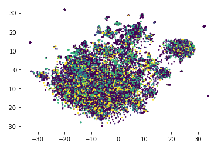
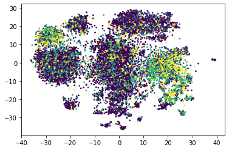

# Multi-modal Machine Learning term project - Emotion Recognition

MELD - https://affective-meld.github.io/

IEMOCAP - https://sail.usc.edu/iemocap/index.html

## Unimodal visualizations for textual and visual features

### Textual visualizations

Word-level features extracted with GloVe

Utterance-level features extracted with BERT
